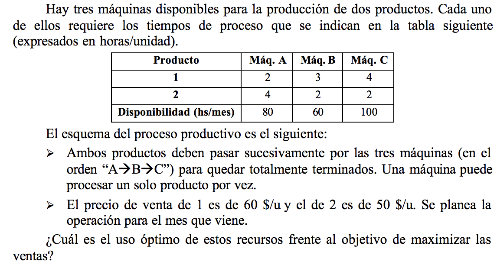
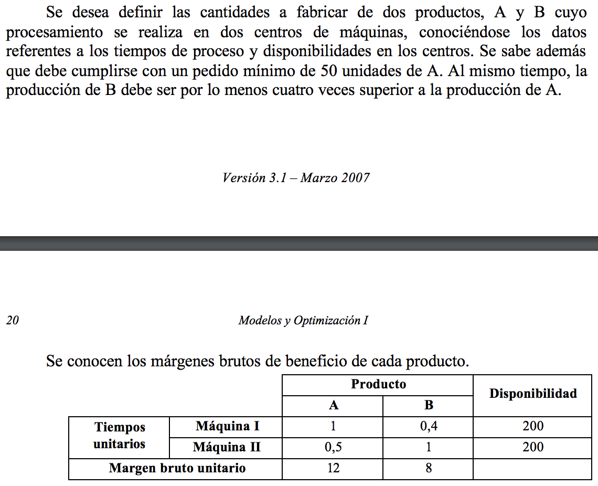
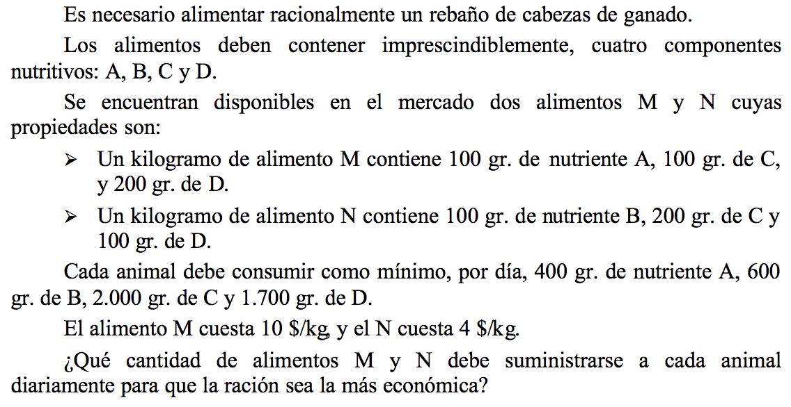

# Practica 19/3 

## Ejercicio 1.2

### Hipótesis
- Se vende todo lo producido.
- No hay desperdicio.
- Todo lo producido sirve, no tiene defectos.
- No hay tiempo perdido entre maquinas.

### Objetivo
Determinar cuanto producir de 1 y 2 para maximizar las ventas en un mes.

### Variables
> X1: Cantidad producida de producto 1.\
X2: Cantidad producida de producto 2.

### Modelo
> MaqA) 2 [Hs/Mes] X1 + 4 [Hs/Mes] X2 <= 80[Hs/Mes]\
MaqB) 3 [Hs/Mes] X1 + 2 [Hs/Mes] X2 <= 60[Hs/Mes]\
MaqC) 4 [Hs/Mes] X1 + 2 [Hs/Mes] X2 <= 100[Hs/Mes]

> Funcional) ZMax = $60 X1 + $50 X2 

## Ejercicio 1.2

### Hipótesis
- Se vende todo lo producido.
- No hay desperdicio.
- Precio no varia.
- No es necesaria pasar por las dos maquinas para un producto.
- Todo lo producido sirve y tiene la misma calidad sin depender de la maquina, no tiene defectos.
- No hay tiempo perdido entre maquinas.

### Objetivo
Determinar cuanto producir de A y B para maximizar las ganancias en un periodo determinado.

### Variables
> XA: Cantidad producida de producto A.\
XAi: Cantidad producida de producto A en maquina I.\
XAii: Cantidad producida de producto A en maquina II.

_Idem para producto B (Mismas cantidad de variables)_

### Modelo
> A) XA = XAi + XAii\
B) XB = XBi + XBii\
MinimoA) XA => 50\
MinimoB) XB => 4 XA\
MaqI) XAi + 0,4 XBi <= 200\
MaqII) 0,5 XAii + XBii <= 200

> Funcional) ZMax = $12 XA + $8 XB 

## Ejercicio 1.5

### Hipótesis
- No hay stock inicial.
- Precio no varia.
- No cambian los nutrientes de c/kilo.
- Todo lo comprado se consume.
- La calidad sin depender de los nutrientes en M y N es la misma.

### Objetivo
Determinar cuanto alimentos de A y B debe suministrarse en un dia a un ganado para minimizar costos.

### Variables
> XM: Cantidad de alimentos de M.\
XN: Cantidad de alimentos de N.

_Idem para producto B (Mismas cantidad de variables)_

### Modelo
> A) 100 XM + 0 XN => 400\
B) 0 XM + 100 XN => 600\
C) 100 XM + 200 XN => 2000\
B) 200 XM + 100 XN => 1700

_Es una mezcla y no se usan variables para los nutrientes porque si lo hiciera dejaria que el modelo cambia la composicion de los alimentos M y N._

> Funcional) ZMin = $10 XM + $4 XN 