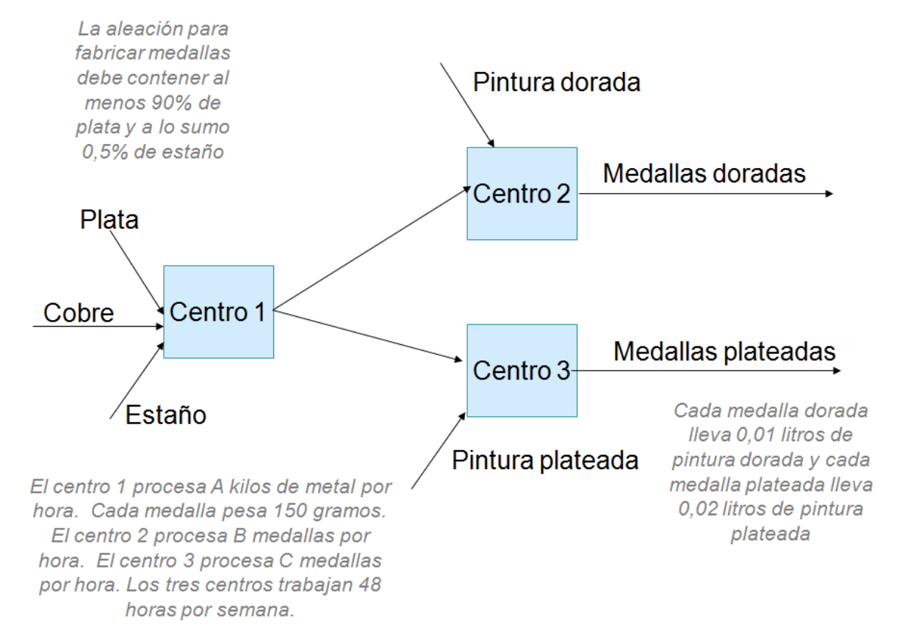
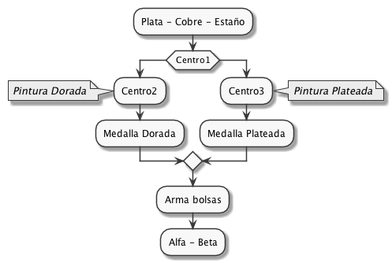

# Teorica 20/3 
## Siguiendo con el ejemplo de las botellas de la clase pasada:

>MAX 7 DC + 4 LV\
BOTELLA) 1 DC + 1 LV <= 400\
ETIQUETA) 1 DC + 1 LV <= 500\
SUSTBASE) 0.2 DC + 0.1 LV <= 60\
AROMAT) 0.04 DC + 0.25 LV <= 70\
MINDC) DC >= 100\
MINLV) LV >= 80\
MAXLV) LV <= 280
-   Que pasa si se rompe el flete de las botellas y ahora nos cobra $2 mas por cada botella y como maximo transporta 300 botellas
    -   Se agrega condicion:
    > FLETE) 1DC + 1LV <= 300
    -   Se cambia funcional:
    > Zmax = 5DC + 2LV
    
    _Se le restó 2 de ganancia a cada uno_
-   Ahora el flete cobra $1 mas por cada botella si se pide menos de 300 y $2 mas si las botellas son mas de 300
    -   Se definen:
    > **EXCESO**: Unidades transportadas por encima de 300  
    **FALTANTE**: Unidades transportadas por debajo de los 300
    - Se cambia la condición de flete utilizando que 300 es la **meta**:
    > FLETE) 1DC + 1LV - 300 = EXCESO - FALTANTE
    
    _Validando con ejemplos_
    
    
    | 1DC + 1LV     | - | META   | = | EXCESO | - | FALTANTE |
    |:-------------:|:-:|:------:|:-:|:------:|:-:|:--------:|
    | 280           | - | 300    | = | 0      | - | 20       |
    | 350           | - | 300    | = | 50     | - | 0        |

    -   Se cambia funcional:
    > Zmax = 5DC + 2LV - 2EXCESO - 1FALTANTE

## Supuestos Básicos
- Definición de conceptos de Divisibilidad, Certeza, etc.

## Ejercicio con proceso de producción
### Armado vs Mezcla

#### Objetivo
**Determinar** composición de la aleación, cantidad de _Alfa_ y _Beta_ a vender (ya sabiendo las bolsas se cuántas medallas tengo) **por semana para** maximizar la ganancia (Ingresos por ventas - Costo Materia Prima)

#### Variables
> **Ag**: Plata entrante al Centro 1 
**Cu**: Cobre entrante al Centro 1 
**Sn**: Estaño entrante al Centro 1 
**MC1C2**: Medallas resultantes del Centro 1 entrantes al Centro 2 
**MC1C3**: Medallas resultantes del Centro 1 entrantes al Centro 3 
**PP**: Cantidad de pintura plateada usada 
**PD**: Cantidad de pintura doradas usada 
**MP**: Cantidad de medallas plateada producidas 
**MD**: Cantidad de pintura doradas producidas 
**ALFA**: Cantidad de bolsas alfa 
**BETA**: Cantidad de bolsas beta 

#### Modelo

##### Centro 1 (Mezcla)
- ##### Relacion Entrada - Salida
    Para restringir que si entran X cantidad de recursos salen X cantidad de recursos.
    > Ag + Cu + Sn [Kg/semana] = 0,15 [Kg/medalla] (MC1C2+ MC1C3) [Medallas/semana]

    _Si no pongo el 0,15 estaria diciendo que cada medalla pesaria un kilo._ 
    _Podria haber una merma como: La salida es el 90% de lo que entra._

- ##### Disponibilidad de materia prima
    Para limitar cantidad de Plata, Cobre y Estaño a las constantes del enunciado (E, F, etc).

- ##### Mezcla Entrada
    Para declarar forma de la composición
    - La aleacion debe contener al menos 90% de Plata (Probar con valores para probar las fórmulas ; Si tengo (Ag + Cu + Sn) = 100 => Cuanto deberia tener de Ag?).
    > 0,9 (Ag + Cu + Sn) <= Ag
    - La aleacion debe contener a lo sumo 0,5% de Estaño.
    > 0,05(Ag + Cu + Sn) => Sn

- ##### Capacidad productiva
    Para restricciones de productividad
    - Tengo 48 hs por semana que puede trabajar la maquina del Centro 1.
    > (Ag + Cu + Sn) <= 48 [Hs/semana] . A [Hs/semana] _//Chequear unidades en diapositiva_

##### Centro 2
- ##### Relación Entrada/Salida (E/S):
> MC1C2 = MD
- ##### Uso de pintura:
>PD [Ls/semana] = 0,01 [Ls/Medalla] MD [Medalla/Semana]
- ##### Disponibilidad de Pintura dorada:
>PD [Ls/semana] < G [Ls/semana]
- ##### Capacidad productiva:
>(MC1C2) [Medalla/Semana] < B [Medalla/Hs] 48 [Hs/Semana] 

##### Centro 3
- ##### Relación Entrada/Salida (E/S):
>C1C3 = MP
- ##### Uso de pintura:
>PP [Ls/semana] = 0,02 [Ls/Medalla] MP [Medalla/Semana]
- ##### Disponibilidad de Pintura plateada:
>PP [Ls/semana] < H [Ls/semana]
- ##### Capacidad productiva:
>(MC1C3) [Medalla/Semana] < C (Medalla/H) 48 [Hs/Semana] 

##### Hacer las bolsas (Armado)
> MD = 3 ALFA + 1 BETA _// Si ALFA = 2 y BETA = 1 => Necesito 7 MD_ 
MP [Medallas/Semana] = 2 [Medallas/Bolsa] ALFA [Bolsa/Semana] + 4 [Medallas/Bolsa] BETA [Bolsa/Semana] 

##### Demanda Maxima
> ALFA <= A2 _// A2 constante de enunciado_  
BETA <= T2 _// T2 constante de enunciado_

##### Funcional
> Zmax = $A1 ALFA + $T1 BETA - $P1 Ag - $P2 Cu - $P3 Sn - $P4 PD - $P5 PP
