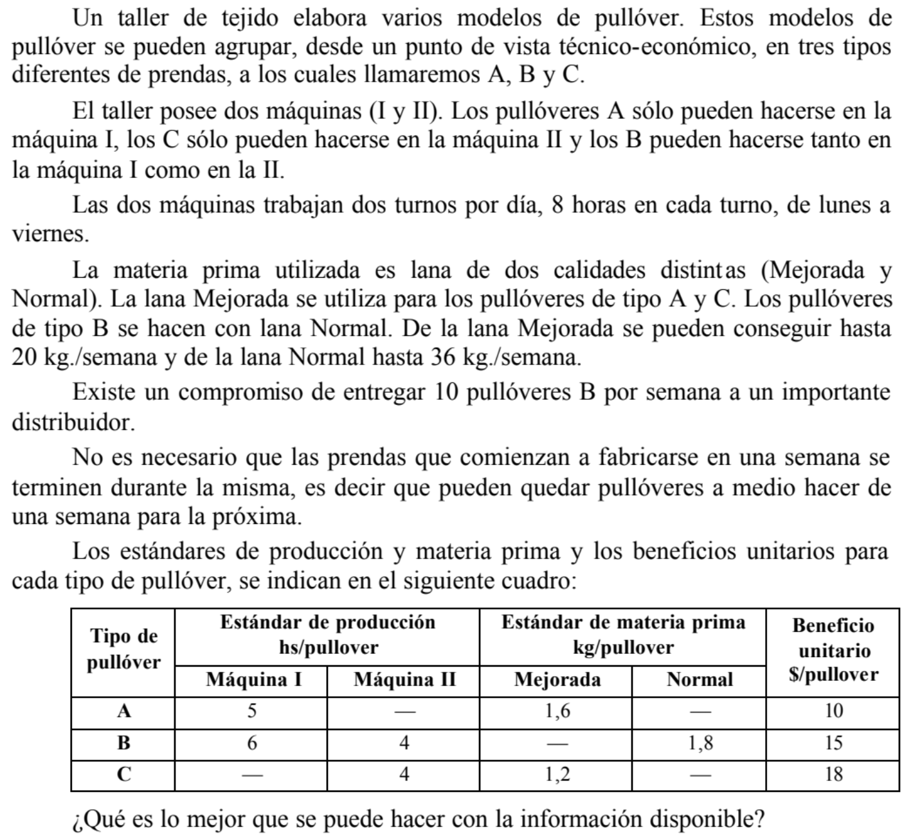

# Practica 26/3 

## Ejercicio 2.1

### Hipótesis
- Se vende todo lo producido.
- No hay desperdicio.
- Todo lo producido sirve, no tiene defectos.
- No hay tiempo perdido entre maquinas.
- Las maquinas no se rompen
- No hay costos

### Objetivo
Determinar cuanto producir de A, B y C para maximizar el beneficio en una semana.

### Variables
> XA: Cantidad producida de producto A.\
XB: Cantidad producida de producto B.\
XC: Cantidad producida de producto C.\
XBi: Cantidad producida de producto B en la maquina I.\
XBii: Cantidad producida de producto B en la maquina II.

### Modelo
- ##### Producto B por Maquina
> B) XB = XBi + XBii\
MinimoB) XB <= 10

- ##### Disponibilidad Maquinas
>MaqI) 5 [Hs/Pullover] XA + 6 [Hs/Pullover] XBi <= 80\
MaqII) 4 [Hs/Pullover] XC + 4 [Hs/Pullover] XBii <= 80

- ##### Disponibilidad de materia prima
> LM) 1.8 [Ks/Pullover] XB <= 20 [Ks/Semana]\
LN) 1.6 [Ks/Pullover] XA + 1.2 [Ks/Pullover] XC <= 36 [Ks/Semana]

- ##### Funcional
> Funcional) ZMax = $10 XA + $15 XB + $18 XC 

## Ejercicio 2.2 (Ejercicio de mezcla)

### Hipótesis
- Se vende todo lo producido.
- No hay desperdicio.
- Todo lo extraido sirve, no tiene defectos.
- La calidad es igual sin importar el yacimiento.
- Lo extraido de otros no sirve para nada.

### Objetivo
Determinar cuanto extraer de cada yacimiento y producir de A y B asi como su composicion para maximizar las ganancias en un tiempo determinado.

### Variables
> XA: Cantidad producida de la aleacion A.\
XB: Cantidad producida de la aleacion B.\
SA: Cantidad extraida de Sierra Alta.\
SC: Cantidad extraida de Sierra Chica.\
EA: Cantidad extraida de El Abra.\
ECu: Cantidad extraida de cobre.\
EEs: Cantidad extraida de estaño.\
EMg: Cantidad extraida de magneso.\
EZ: Cantidad extraida de zinc.

### Modelo

- ##### Disponibilidad
> SA) SA <=  1000\
SC) SC <=  2000\
EA) EA <=  3000

- ##### Composicion extraccion
_Seria importante cambiar las igualdades por <= para no limitar al modelo y evitar incompatibilidades_
>Cu) ECu =  0,20 SA + 0,10 SC + 0,05 EA\
Es) EEs =  0,10 SA + 0,20 SC + 0,05 EA\
Mg) EMg =  0,30 SA + 0,30 SC + 0,70 EA\
Z) EZ =  0,30 SA + 0,30 SC + 0,20 EA

- ##### Mezcla
> Cu-A) XA <= 0,8 ECu\
Es-A) XA <= 0,3 EEs\
Z-A) XA => 0,5 EZ\
Es-B) 0,6 EEs => XB => 0,4 EEs\
Mg-B) XB => 0,3 EMg\
Z-B) XB <= 0,7 EZ

*Esta mal => se tiene que abrir lo extraido de cada mineral para cada aleacion*

*Agregar un restriccion para que el Zinc no puede ser todo en A*
- ##### Funcional
> Funcional) ZMax = $A XA + $B XB - (10 SA + 40 SC + 50 EA)

## Ejercicio 2.4 (Ejercicio de Recursividad)

### Hipótesis
- Lo comprado y fabricado son identicos.
- Los tiempos son netos, no se pierde tiempo entre procesos.
- No hay desperdicio de tiempos.
- El dinero no es limitante.

### Objetivo
Determinar la cantidad de produccion y compra de tableros para minimizar costos para un determinado tiempo.

### Variables
> XAAprob: Cantidad aprobada de tableros A.\
XAProd: Cantidad producida de tableros A.\
XACompra: Cantidad comprada de tableros A.\

_Idem demas tableros_

### Modelo
- ##### Minimo
>MinA) XAAprob = 4000\
MinB) XBAprob = 3000\
MinC) XCAprob = 8000\
MinD) XDAprob = 5000
_Corregir: Seria sumando Producido con Comprados_

- ##### Disponibilidad Hs
> Fabricacion) 0,34 XAProd + 0,38 XBProd + 0,47 XCProd + 0,50 XDProd<=  6500\
Ajuste) 1/ (1 - 0,1)(0,08 XAProd + 0,06 XBProd + 0,10 XCProd + 0,12 XDProd)<=  1000\
Calidad) 1/ (1 - 0,1)(0,02 XAProd + 0,03 XBProd + 0,03 XCProd + 0,03 XDProd) + 1/ (1 - 0,2)(0,03 XACompra + 0,05 XBCompra + 0,04 XCCompra + 0,04 XDCompra)<=  600

_Para la recursividad:_

*1/ (1 - Tasa de Rechazo)*

_Entran 100, con ajuste pasan 90 vuelven 10, la segunda vez, con ajuste pasa 9 vuelve 1, ...._

- ##### Porcentaje Aprob
>Aprobacion) XAAprob + XBAprob + XCAprob + XDAprob =  0.9(XAProd + XBProd + XCProd + XDProd) + 0.8(XACompra + XBCompra + XCCompra + XDCompra)

_Corregir: no es necesario_

- ##### Funcional
> Funcional) ZMin = 50 XAProd + 80 XACompra + 60 XBProd + 75 XBCompra + 120 XCProd + 180 XCCompra + 100 XDProd + 80 XDCompra

## Ejercicio 2.10 (Ejercicio de armado)

### Hipótesis
- No hay costos
- El tiempo es despreciable, no hay limitante.
- No hay limitante de dinero para comprar.
- No hay desperdicio, todas las flores sirven.
- Vendo todo lo que produzco

### Objetivo
Determinar la cantidad de atados de flores a comprar y fabricar para maximizar ganancias para un dia.

### Variables
> XAAprob: Cantidad aprobada de tableros A.\
XAProd: Cantidad producida de tableros A.\
XACompra: Cantidad comprada de tableros A.\

### Modelo

## Ejercicio 2.14

