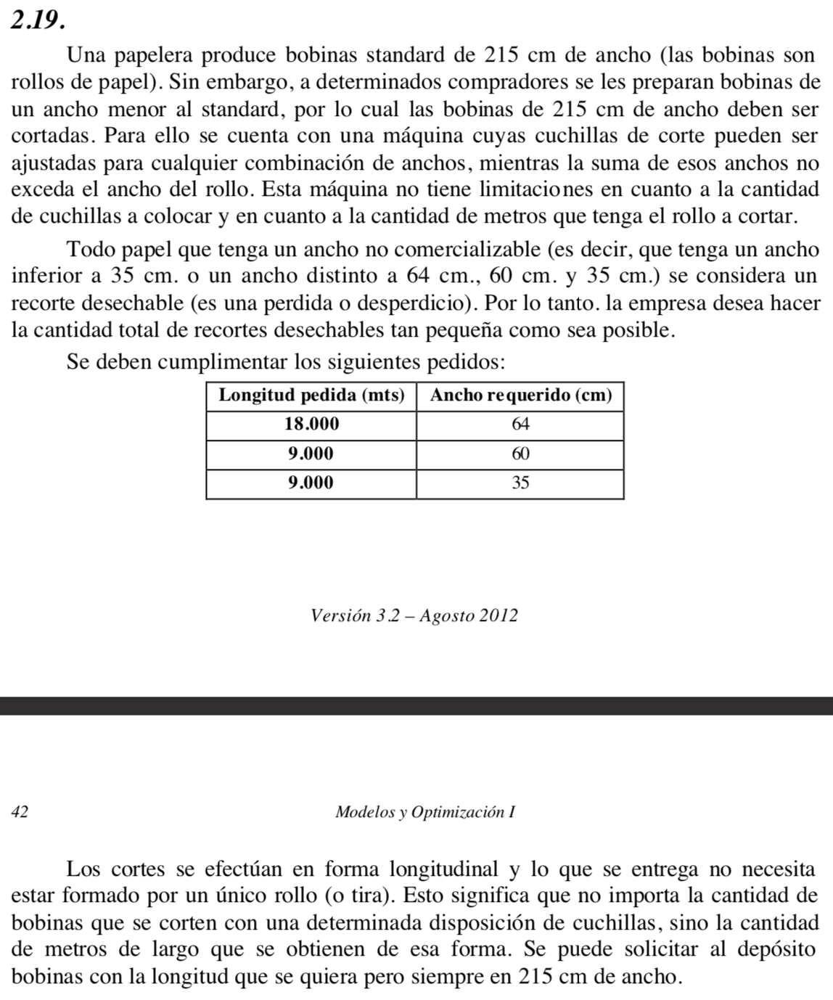

# Practica 9/4

## Ejercicio 2.19

Los tipos de corte son constantes, **no variables**.
| | 64 | 60 | 35 | DES |
|:---:|:---:|:---:|:---:|:---:|
|C1|3|0|0|23|
|C7|0|3|1|0|
|...|...|...|...|...|

### Objetivo
Determinar la longitud de cortes para minimizar el desperdicio en un periodo de tiempo.
### Hipotesis
- No considero como desecho cuando los cortes de 64, 60 y 35 superan la cantidad requerida al pedido.

### Variables
> Ci: Longitud a cortar para tipo de corte i {i: 1..10}. [cm/t]\
> C64: Longitud de cortes con ancho 64 (Idem 60 y 35). [cm/t]
### Modelo
#### 'Composicion'
> C64 = 3 C1 + 2 C2 + C4 + C5 + C6\
> C60 = C2 + 2 C4 + C5 + 3 C7 + 2 C8 + C9\
> C35 = 2 C3 + 2 C5 + 4 C6 + C7 + 2 C8 + 4 C9 + 6 C10

#### Desperdicio
> DES = 23 C1 + 27 C2 + 17 C3 + ... + 5 C10

#### Minimo
> C64 ≥ 18000 100 [cm/m]\
> C60 ≥ 9000 100 [cm/m]\
> C35 ≥ 9000 100 [cm/m]

### Funcional
> Zmin = DES

## Ejercicio 4.8

| Ci |  X |  Bi | X1 | X2 | X3 | X4 | X5 | Theta |
|:--:|:--:|:---:|:--:|:--:|:--:|:--:|:--:|:-----:|
|  0 | X3 |  48 |  2 |  4 |  1 |  0 |  0 |   24  |
|  0 | X4 |  60 |  4 |  2 |  0 |  1 |  0 |   15  |
|  0 | X5 |  45 |  3 |  0 |  0 |  0 |  1 |   15  |
|    |    | Z=0 | -6 | -4 |  0 |  0 |  0 |       |

- Los dos 15 me dan un punto degenerado en la proxima tabla.
- Sale X5 entra X1

| Ci |  X |  Bi  | X1 | X2 | X3 | X4 |  X5  |   Theta  |
|:--:|:--:|:----:|:--:|:--:|:--:|:--:|:----:|:--------:|
|  0 | X3 |  18  |  0 |  4 |  1 |  0 | -2/3 |    9/2   |
|  0 | X4 |   0  |  0 |  2 |  0 |  1 | -4/3 |     0    |
|  6 | X1 |  15  |  1 |  0 |  0 |  0 |  1/3 | infinito |
|    |    | Z=90 |  0 | -4 |  0 |  0 |   2  |          |

- El Bi en X4 es 0, por lo que es un **pto degenerado**.
- Para proxima tabla sale X4, y quedaria otra mas para la optima.

## Ejercicio 4.10

| Ci |  X |  Bi |   A1   |   A2  | A3 | A4 | A5 | A6 | A7 | A8 | Theta |
|:--:|:--:|:---:|:------:|:-----:|:--:|:--:|:--:|:--:|:--:|:--:|:-----:|
| -M | m1 |  2  |    0   |   1   | -1 |  0 |  0 |  1 |  0 |  0 |   0   |
| -M | m2 |  24 |    4   |   6   |  0 | -1 |  0 |  0 |  1 |  0 |   6   |
| -M | m3 |  30 |   10   |  -30  |  0 |  0 | -1 |  0 |  0 |  1 |   3   |
|    |    | Z=0 | -14M-1 | 24M-8 |  M |  M |  M |  0 |  0 |  0 |       |
- Sale m3
- Entra A1

| Ci |  X |  Bi | A1 |    A2   | A3 | A4 |     A5     | A6 | A7 |   A8   | Theta |
|:--:|:--:|:---:|:--:|:-------:|:--:|:--:|:----------:|:--:|:--:|:------:|:-----:|
| -M | m1 |  2  |  0 |    1    | -1 |  0 |      0     |  1 |  0 |    0   |   2   |
| -M | m2 |  12 |  0 |    18   |  0 | -1 |     2/5    |  0 |  1 |    0   |  2/3  |
|  1 | X1 |  3  |  1 |    -3   |  0 |  0 |    -1/10   |  0 |  0 |    1   |   -1  |
|    |    | Z=0 |  0 | -11-19M |  M |  M | -1/10-2/5M |  0 |  0 | 1-3/5M |       |

| Ci |  X |  Bi | A1 | A2 | A3 |      A4     |     A5     | A6 |      A7     |     A8     | Theta |
|:--:|:--:|:---:|:--:|:--:|:--:|:-----------:|:----------:|:--:|:-----------:|:----------:|:-----:|
| -M | m1 | 4/3 |  0 |  0 | -1 |     1/18    |    -1/45   |  1 |     -1/18   |    1/45    |   24  |
|  8 | X2 | 2/3 |  0 |  1 |  0 |    -1/18    |    1/45    |  0 |     1/18    |    -1/45   |  -12  |
|  1 | X1 |  5  |  1 |  0 |  0 |     -1/6    |    -1/30   |  0 |     1/6     |    1/30    |  -5/6 |
|    |    |     |  0 |  0 |  M | -11/18-M/18 | 13/90+M/45 |  0 | (Algo-M)/18 | (2M-13)/90 |       |
- Sale m1
  
### Para la proxima tabla hay una variable que quiere entrar pero ninguna puede salir porque todo Theta < 0 => Poliedro abierto

## Ejercicio 4.12

| Ci |  X | Bi |  A1 |   A2  | A3 | A4 | A5 | A6 | Theta |
|:--:|:--:|:--:|:---:|:-----:|:--:|:--:|:--:|:--:|:-----:|
|  0 | X3 |  6 |  1  |   1   |  1 |  0 |  0 |  0 |   6   |
|  0 | X4 |  1 |  2  |   1   |  0 |  1 |  0 |  0 |   1   |
| -M | m1 |  8 |  -1 |   2   |  0 |  0 | -1 |  1 |   4   |
|    |    |    | M-3 | -2M-1 |  0 |  0 |  M |  0 |       |
- Sale X4
- Entra X2
  
| Ci |  X | Bi |  A1  | A2 | A3 |  A4  | A5 | A6 | Theta |
|:--:|:--:|:--:|:----:|:--:|:--:|:----:|:--:|:--:|:-----:|
|  0 | X3 |  5 |  -1  |  0 |  1 |  -1  |  0 |  0 |       |
|  1 | X2 |  1 |   2  |  1 |  0 |   1  |  0 |  0 |       |
| -M | m1 |  6 |  -5  |  0 |  0 |  -2  | -1 |  1 |       |
|    |    |    | 5M-1 |  0 |  0 | 1+2M |  M |  0 |       |

- Nadie puede entrar => todos Zj - Cj > 0 en problema de maximo.
- **El sistema es incompatible, por tener una variable artificial (m1) en la base**.

## Ejercicio 4.20

- El problema es de maxima por que la solucion optima y por el poliedro es la mas alejada del 0.
- Con las restricciones se hace el simplex.
- Es de soluciones alternativas por tener multiples puntos optimos.
- En la tabla optima Zj -Cj = 0 en una variable que no pertenece a la base => infinitas soluciones (Haciendo entrar esta variable encontramos el otro vertice optimo)

## Ejercicio 4.22

### A)
C = 0 por necesitar punto degenerado.\
D = 0,F = 1,J = 0 por canonico\
H,K,L <= 0 por ser problema de minimo y tabla optima\
-4 B + 3 G = L ≤ 0 _(≤ porque puede ser soluciones alternativas)_\
B + 9 - A = H ≤ 0 _(≤ porque puede ser soluciones alternativas)_\
B E - 3 = K ≤ 0 _(≤ porque puede ser soluciones alternativas)_

### B)
D = 0,F = 1,J = 0 por canonico\
H ó K ó L < 0 al menos una por problema de maximizacion\
Descarto X6 para entrar, solo puedo entrar X5. En la sig tabla la columna Theta va a ser (16/E, C/1, negativo) => E > 0 y C > 0 y 16 E = C\
-4 B + 3 G = L ≤ 0 _(≤ porque puede ser soluciones alternativas)_\
B + 9 - A = H ≤ 0 _(≤ porque puede ser soluciones alternativas)_\
B E - 3 = K ≤ 0 _(≤ porque puede ser soluciones alternativas)_

### C)
-4 B + 3 G = L ≤ 0 _(≤ porque puede ser soluciones alternativas)_\
B + 9 - A = H ≤ 0 _(≤ porque puede ser soluciones alternativas)_\
B E - 3 = K ≤ 0 _(≤ porque puede ser soluciones alternativas)_\
En la sig tabla la columna Theta va a ser (-, -, 24/G) => G ≤ 0\

## Tip TP
Bivalente para si el cliente prefiere el producto i en promocion antes que el producto j en precio regular.